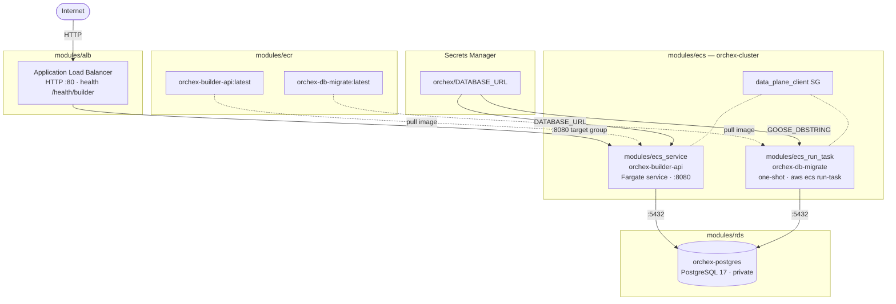
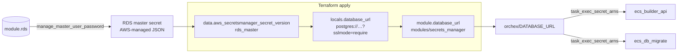
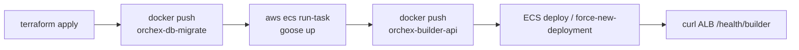

# Orchex infrastructure

Terraform for AWS resources. Provisions:

- **ECR** — `orchex-builder-api` (API) and `orchex-db-migrate` (goose migrations)
- **ECS Fargate** — shared cluster, builder **service**, and migrate **run-task** definition
- **Secrets Manager** — shared `orchex/DATABASE_URL` (Postgres URL for ECS tasks)
- **RDS PostgreSQL 17** — `orchex-postgres` (private, master password in Secrets Manager)
- **ALB** — HTTP → builder API on `:8080`

Terraform creates and wires the infrastructure. Container images are built with Docker and pushed to ECR separately (see [Lifecycle](#lifecycle)).

## Layout

```text
infra/
  terraform.tf      # required Terraform / provider versions
  providers.tf      # AWS provider (region, profile, default tags)
  variables.tf      # shared variables (region, environment)
  main.tf           # root modules (ECR, ALB, ECS, ECS service, ECS migrate task, RDS, secrets)
  outputs.tf        # root outputs
  modules/
    ecr/            # ECR repository for container images
    alb/            # internet-facing ALB + target group
    ecs/            # shared Fargate cluster + data_plane_client SG
    ecs_service/    # Fargate service (task definition, SG, ALB attachment)
    ecs_run_task/   # one-shot Fargate task definition (migrations via run-task)
    secrets_manager/# Secrets Manager secret + version
    rds/            # PostgreSQL RDS (subnet group, SG, instance)
```

### Root modules (`main.tf`)

| Module            | AWS resources                           | Purpose                                |
| ----------------- | --------------------------------------- | -------------------------------------- |
| `ecr_builder_api` | ECR `orchex-builder-api`                | Builder API image                      |
| `ecr_db_migrate`  | ECR `orchex-db-migrate`                 | Goose migrate image                    |
| `alb`             | ALB, listener, target group             | Public HTTP → builder API              |
| `ecs`             | Fargate cluster, `data_plane_client` SG | Shared compute + RDS client identity   |
| `rds`             | RDS PostgreSQL 17                       | Application database                   |
| `database_url`    | Secrets Manager `orchex/DATABASE_URL`   | Shared Postgres URL for ECS tasks      |
| `ecs_db_migrate`  | ECS task definition only                | One-shot `aws ecs run-task` migrations |
| `ecs_builder_api` | ECS service + task definition           | Long-running builder API behind ALB    |

Root-level `data.aws_secretsmanager_secret_version.rds_master` reads the RDS-managed master secret so Terraform can compose `DATABASE_URL` (not injected into ECS tasks directly).

## Prerequisites

- [Terraform](https://developer.hashicorp.com/terraform/install) matching `required_version` in `terraform.tf`
- [AWS CLI](https://docs.aws.amazon.com/cli/latest/userguide/getting-started-install.html) v2
- [Docker](https://docs.docker.com/get-docker/)
- [`jq`](https://jqlang.github.io/jq/) (optional, for reading JSON outputs)

### AWS CLI login (required)

You **must** be logged in to AWS via the CLI before running `terraform plan`, `terraform apply`, or any `aws` commands. Terraform uses the profile named in `providers.tf` (default: `orchex`).

**SSO (recommended):**

```bash
aws sso login --profile orchex
```

**Named profile with access keys:**

```bash
export AWS_PROFILE=orchex
# or: aws configure --profile orchex
```

Verify credentials:

```bash
aws sts get-caller-identity --profile orchex
```

Set the AWS profile name in `providers.tf` to match your local setup. Do not commit access keys or secrets.

Default region is `ap-south-1` (`var.aws_region`). Override when needed:

```bash
terraform apply -var='aws_region=YOUR_REGION'
```

Default environment is `production` (`var.environment`). Override when needed:

```bash
terraform apply -var='environment=staging'
```

## Tagging

All resources receive provider default tags plus module-level tags:

| Tag           | Source            | Example values                                                               |
| ------------- | ----------------- | ---------------------------------------------------------------------------- |
| `Project`     | provider default  | `orchex`                                                                     |
| `Environment` | `var.environment` | `production`                                                                 |
| `Service`     | per module        | `builder-api`, `shared`                                                      |
| `Component`   | per module        | `ecr`, `alb`, `ecs`, `ecs-service`, `ecs-run-task`, `rds`, `secrets-manager` |
| `Name`        | per resource      | `orchex-postgres`, `orchex-builder-api`                                      |

App-specific resources (`ecr_builder_api`, `ecs_builder_api`) use `Service = builder-api`. Shared infrastructure (ALB, ECS cluster, RDS, migrate ECR/task, app secret) uses `Service = shared`.

## Infrastructure architecture

Root `main.tf` composes the modules above. Traffic flows from the ALB to Fargate tasks in the default VPC. ECS tasks reach RDS over the VPC using a shared **`data_plane_client`** security group. Database credentials reach tasks via the shared **`orchex/DATABASE_URL`** secret (not the RDS master secret).

### Runtime architecture



Solid arrows are request or database traffic. Dotted arrows are image pulls or security-group attachment (both tasks use **`data_plane_client`** for RDS access).

### Secrets and bootstrap

Terraform composes the app connection string from the RDS-managed master secret at apply time. ECS tasks never read the master secret at runtime.



### Release flow (operations)



See [Lifecycle](#lifecycle) for commands.

### Configuration and secrets

| Secret / env                                           | Set by                            | Consumed by                                                           |
| ------------------------------------------------------ | --------------------------------- | --------------------------------------------------------------------- |
| RDS master JSON (`username`, `password`, …)            | RDS `manage_master_user_password` | Terraform data source only                                            |
| `orchex/DATABASE_URL` (`postgres://…?sslmode=require`) | `module.database_url`             | ECS builder service (`DATABASE_URL`), migrate task (`GOOSE_DBSTRING`) |
| `HTTP_ADDR=:8080`                                      | Task definition env               | Builder API container                                                 |

ECS **task execution roles** get `secretsmanager:GetSecretValue` on `orchex/DATABASE_URL` via `task_exec_secret_arns`. Tasks do **not** read the RDS master secret at runtime.

### `modules/ecr`

- Wraps [terraform-aws-modules/ecr/aws](https://registry.terraform.io/modules/terraform-aws-modules/ecr/aws) v3.2.0.
- Two private repositories in root `main.tf`:
  - **`orchex-builder-api`** — `Service = builder-api`
  - **`orchex-db-migrate`** — `Service = shared`
- **`repository_force_delete = true`** — full `terraform destroy` deletes repos even when images exist (see [Destroy infrastructure](#destroy-infrastructure)).
- Lifecycle policy keeps only the newest tagged image and expires untagged layers after one day.

### `modules/alb`

- Wraps [terraform-aws-modules/alb/aws](https://registry.terraform.io/modules/terraform-aws-modules/alb/aws).
- Creates an internet-facing ALB in the account **default VPC** and its public subnets.
- Listener on **port 80** forwards all HTTP traffic to the `builder` target group.
- Target group uses **IP** mode on **port 8080** (Fargate `awsvpc`); ECS registers task IPs—`create_attachment = false` in Terraform.
- Health checks hit **`/health/builder`** and expect HTTP 200.
- ALB security group allows inbound **80** from `0.0.0.0/0`.

### `modules/ecs`

- Wraps [terraform-aws-modules/ecs/aws//modules/cluster](https://registry.terraform.io/modules/terraform-aws-modules/ecs/aws).
- Creates a shared **Fargate** cluster (`orchex-cluster`).
- Creates a shared **`data_plane_client`** security group (`orchex-cluster-data-plane-client`). Every ECS service attaches this SG to its task ENI so RDS can allow Postgres access by security group identity.
- Container Insights is disabled for early-stage cost; enable later if needed.

### `modules/ecs_service`

- Wraps [terraform-aws-modules/ecs/aws//modules/service](https://registry.terraform.io/modules/terraform-aws-modules/ecs/aws) v7.5.0.
- Runs the builder API as a Fargate **service** (`orchex-builder-api`) on the shared cluster (`desired_count = 1`).
- Pulls the image from **ECR** (`orchex-builder-api:latest`).
- **Secrets**: injects `DATABASE_URL` from `var.database_url_secret_arn`; grants the task execution role access via `task_exec_secret_arns`.
- **Environment**: `HTTP_ADDR=:8080`.
- **Load balancer**: attaches the service to the ALB target group; ECS keeps registrations in sync as tasks start/stop.
- **Networking**: tasks get a public IP in default VPC subnets. Each task ENI has two security groups:
  - **Service SG** — ingress on `:8080` only from the **ALB security group**
  - **`data_plane_client` SG** — required client identity for RDS access (`data_plane_client_security_group_id` from `module.ecs`).
- Tagged with `Service = builder-api` (via `service` variable) and `Component = ecs-service`.
- Container runs with a read-only root filesystem (distroless image).

### `modules/ecs_run_task`

- Wraps the same ECS service module with **`create_service = false`** — task definition only, no long-running service.
- Used for **`orchex-db-migrate`**: goose migrations via `aws ecs run-task`.
- **`create_service = false`** — no `desired_count`; the task starts on demand and exits when goose finishes.
- **Secrets**: maps `orchex/DATABASE_URL` → container env **`GOOSE_DBSTRING`**.
- **Environment**: `GOOSE_DRIVER=postgres`, `GOOSE_MIGRATION_DIR=/migrations`.
- Same **`data_plane_client` SG** and default VPC subnets as the builder service (public IP for egress).
- Outputs **`run_task_network_configuration`** (subnets, security groups) for CLI `run-task` commands.
- Tagged with `Component = ecs-run-task`.

### `modules/secrets_manager`

- Wraps [terraform-aws-modules/secrets-manager/aws](https://registry.terraform.io/modules/terraform-aws-modules/secrets-manager/aws) v2.1.0.
- Generic wrapper: creates a Secrets Manager secret + version from `var.secret_string`.
- Root **`module.database_url`** stores the composed Postgres URL at **`orchex/DATABASE_URL`** (`Service = shared`).
- Secret value is built in root `main.tf` from the RDS master secret + RDS endpoint metadata + `sslmode=require`.
- **Note:** the composed URL exists in Terraform state; re-apply after RDS password rotation to refresh it.

### `modules/rds`

- Wraps [terraform-aws-modules/rds/aws](https://registry.terraform.io/modules/terraform-aws-modules/rds/aws) v7.2.1.
- **PostgreSQL 17** on `db.t4g.medium` (2 vCPU, 4 GiB RAM).
- **20 GiB** `gp3` storage (RDS minimum for gp3 Postgres).
- **Single-AZ**, no automated backups (`backup_retention_period = 0`).
- **`publicly_accessible = false`** — no public IP; not reachable from the internet.
- Master password managed by AWS (**Secrets Manager** via `manage_master_user_password`).
- Default database / user: `orchex` / `orchex`.
- **DB subnet group** and **RDS security group** created as standalone resources; the RDS module uses `create_db_subnet_group = false` and `vpc_security_group_ids` pointing at the module SG.
- **RDS security group** allows inbound PostgreSQL (`5432`) only from the shared **`data_plane_client`** security group.
- **Outputs** expose connection metadata only (endpoint, address, port, engine, etc.) plus **`db_instance_master_user_secret_arn`** (sensitive, for Terraform composition only).

Wiring in root `main.tf`:

```hcl
module "ecr_builder_api" { repository_name = "orchex-builder-api" ... }
module "ecr_db_migrate"  { repository_name = "orchex-db-migrate" ... }

module "ecs" { name = "orchex-cluster" ... }
module "rds" {
  data_plane_client_security_group_id = module.ecs.data_plane_client_security_group_id
}

# Compose DATABASE_URL from RDS master secret + endpoint (Terraform state holds the URL)
module "database_url" {
  secret_string = local.database_url  # postgres://…?sslmode=require
}

module "ecs_db_migrate" {
  image                   = "${module.ecr_db_migrate.repository_url}:latest"
  database_url_secret_arn = module.database_url.arn
  data_plane_client_security_group_id = module.ecs.data_plane_client_security_group_id
}

module "ecs_builder_api" {
  image                   = "${module.ecr_builder_api.repository_url}:latest"
  database_url_secret_arn = module.database_url.arn
  target_group_arn        = module.alb.target_groups["builder"].arn
  data_plane_client_security_group_id = module.ecs.data_plane_client_security_group_id
}
```

New ECS services that need database access should:

1. Pass `data_plane_client_security_group_id = module.ecs.data_plane_client_security_group_id`.
2. Pass `database_url_secret_arn = module.database_url.arn` (shared secret) or a dedicated secret module instance.
3. Map the secret to `DATABASE_URL` (or app-specific env names) and set `task_exec_secret_arns`.

For one-shot jobs (migrations, batch work), use **`modules/ecs_run_task`** instead of **`modules/ecs_service`**.

### Container images (built outside Terraform)

| Dockerfile                                    | ECR repository              | ECS consumer                         |
| --------------------------------------------- | --------------------------- | ------------------------------------ |
| [`Dockerfile`](../Dockerfile)                 | `orchex-builder-api:latest` | `module.ecs_builder_api` (service)   |
| [`Dockerfile.migrate`](../Dockerfile.migrate) | `orchex-db-migrate:latest`  | `module.ecs_db_migrate` (`run-task`) |

Both production images pin **`linux/amd64`** and use **distroless** runtimes. Local development uses [`Dockerfile.local`](../Dockerfile.local) and Compose ([`docker-compose.yml`](../docker-compose.yml)) — not deployed by this Terraform stack.

After `terraform apply`, the ALB DNS name is available via `terraform output -json alb`. RDS connection details are under `terraform output -json rds`.

## Lifecycle

End-to-end flow for this stack:

| Step | Action                                       | Section                                             |
| ---- | -------------------------------------------- | --------------------------------------------------- |
| 1    | Create / update AWS resources                | [Create infrastructure](#create-infrastructure)     |
| 2    | Build & push migrate image, run goose on RDS | [Run database migrations](#run-database-migrations) |
| 3    | Build & push API image, deploy ECS service   | [Deploy the builder API](#deploy-the-builder-api)   |
| 4    | Tear down (optional)                         | [Destroy infrastructure](#destroy-infrastructure)   |

Terraform resolves dependency order on **create**. You only need a strict manual order for **migrations** (step 2 before relying on DB-backed API routes) and for **partial destroy** (see below).

Long `terraform apply` / `destroy` runs can exceed SSO session length. Re-authenticate if you see `ExpiredToken`:

```bash
aws sso login --profile orchex
aws sts get-caller-identity --profile orchex
```

## Create infrastructure

Provisions ECR repos, ECS cluster, RDS, Secrets Manager (`orchex/DATABASE_URL`), ALB, builder ECS service, and the migrate task definition.

```bash
cd infra

terraform init
terraform fmt -recursive
terraform plan
terraform apply
```

**Incremental apply** (optional — Terraform handles dependencies):

| Phase | What                                          | `-target` (optional)                                                                                |
| ----- | --------------------------------------------- | --------------------------------------------------------------------------------------------------- |
| A     | Cluster + RDS + app secret + migrate task def | `module.ecs`, `module.rds`, `module.database_url`, `module.ecs_db_migrate`, `module.ecr_db_migrate` |
| B     | Migrations                                    | [Run database migrations](#run-database-migrations) (not Terraform)                                 |
| C     | ALB + builder service                         | `module.alb`, `module.ecs_builder_api`                                                              |

For most cases, a single **`terraform apply`** is enough.

Inspect outputs:

```bash
terraform output
terraform output -json ecr_builder_api
terraform output -json alb | jq -r '.dns_name'
terraform output -json rds | jq
```

| Output                | Meaning                                                         |
| --------------------- | --------------------------------------------------------------- |
| `ecr_builder_api`     | ECR repository URL, name, ARN                                   |
| `ecr_db_migrate`      | Shared goose migration image repository                         |
| `alb`                 | ALB DNS name, target groups, security groups                    |
| `ecs`                 | Shared Fargate cluster ARN / name, `data_plane_client` SG       |
| `ecs_db_migrate`      | Migrate task definition + `run_task_network_configuration`      |
| `ecs_builder_api`     | Builder service task definition, security group, etc.           |
| `database_url_secret` | Shared `orchex/DATABASE_URL` secret ARN / name                  |
| `rds`                 | RDS connection metadata only (see fields below; no credentials) |

**`rds` output fields** (non-sensitive):

| Field                               | Meaning                             |
| ----------------------------------- | ----------------------------------- |
| `db_instance_endpoint`              | Host:port connection string         |
| `db_instance_address`               | Hostname                            |
| `db_instance_port`                  | Port (default `5432`)               |
| `db_instance_name`                  | Database name (`orchex`)            |
| `db_instance_identifier`            | RDS instance id (`orchex-postgres`) |
| `db_instance_arn`                   | Instance ARN                        |
| `db_instance_status`                | e.g. `available`                    |
| `db_instance_engine`                | `postgres`                          |
| `db_instance_engine_version_actual` | Running Postgres version            |
| `db_subnet_group_id`                | DB subnet group name                |
| `security_group_id`                 | RDS security group id               |

Module-level `modules/rds` outputs match the above plus `db_subnet_group_arn` and `security_group_arn`. Username, password, and Secrets Manager ARNs are intentionally omitted.

### RDS connection (after apply)

- **Host**: `terraform output -json rds | jq -r '.db_instance_address'`
- **Port**: `terraform output -json rds | jq -r '.db_instance_port'`
- **Database**: `terraform output -json rds | jq -r '.db_instance_name'`
- **Username / password**: not in Terraform outputs. RDS stores the master password in **Secrets Manager**. Retrieve via the AWS console (RDS → `orchex-postgres` → Configuration) or CLI:

```bash
# List the secret attached to the instance, then fetch the password JSON
aws rds describe-db-instances \
  --db-instance-identifier orchex-postgres \
  --query 'DBInstances[0].MasterUserSecret.SecretArn' \
  --output text \
  --region ap-south-1 \
  --profile orchex

# Then (replace SECRET_ARN):
aws secretsmanager get-secret-value \
  --secret-id SECRET_ARN \
  --query SecretString \
  --output text \
  --region ap-south-1 \
  --profile orchex | jq -r '.password'
```

Only ECS tasks with the `data_plane_client` security group attached can reach the database. The instance is not publicly accessible.

## Run database migrations

After **RDS** and the shared **`orchex/DATABASE_URL`** secret exist (`terraform apply`), apply schema changes with a **one-shot Fargate task** (not a long-running service). The task runs `goose up` and exits.

Use the same region as `var.aws_region`. In **zsh**, always write `${REPO_URL}:latest` (not `$REPO_URL:latest`).

### Build and push the migrate image

```bash
cd infra

MIGRATE_REPO=$(terraform output -json ecr_db_migrate | jq -r '.repository_url')
REGION=ap-south-1   # must match var.aws_region
CLUSTER=$(terraform output -json ecs | jq -r '.name')

aws sso login --profile orchex   # if needed

aws ecr get-login-password --region "$REGION" --profile orchex \
  | docker login --username AWS --password-stdin "$(echo "$MIGRATE_REPO" | cut -d/ -f1)"

cd ..
docker build -f Dockerfile.migrate -t "${MIGRATE_REPO}:latest" .
docker push "${MIGRATE_REPO}:latest"
```

### Run migrations (`aws ecs run-task`)

Reads `GOOSE_DBSTRING` from the shared `orchex/DATABASE_URL` secret. Set `CLUSTER` if you are not reusing the shell from above:

```bash
cd infra

REGION=ap-south-1
CLUSTER=$(terraform output -json ecs | jq -r '.name')
TASK_DEF=$(terraform output -json ecs_db_migrate | jq -r '.task_definition_family')
NET=$(terraform output -json ecs_db_migrate | jq -r '.run_task_network_configuration')
SUBNETS=$(echo "$NET" | jq -r '.subnets')
SGS=$(echo "$NET" | jq -r '.security_groups')

TASK_ARN=$(aws ecs run-task \
  --cluster "$CLUSTER" \
  --task-definition "$TASK_DEF" \
  --launch-type FARGATE \
  --network-configuration "awsvpcConfiguration={subnets=[$SUBNETS],securityGroups=[$SGS],assignPublicIp=ENABLED}" \
  --region "$REGION" \
  --profile orchex \
  --query 'tasks[0].taskArn' \
  --output text)

aws ecs wait tasks-stopped --cluster "$CLUSTER" --tasks "$TASK_ARN" --region "$REGION" --profile orchex

aws ecs describe-tasks \
  --cluster "$CLUSTER" \
  --tasks "$TASK_ARN" \
  --region "$REGION" \
  --profile orchex \
  --query 'tasks[0].containers[0].{exitCode:exitCode,reason:reason}' \
  --output json
```

Expect `"exitCode": 0`. Re-run after pushing a new migrate image whenever `db/migrations/` changes.

On a **fresh database**, RDS logs may show `relation "goose_db_version" does not exist` once while goose bootstraps its version table — that is normal if the task still exits `0`.

## Deploy the builder API

Use the same region as `var.aws_region`. In **zsh**, always write `${REPO_URL}:tag` (not `$REPO_URL:tag`).

```bash
cd infra

REPO_URL=$(terraform output -json ecr_builder_api | jq -r '.repository_url')
REGION=ap-south-1   # must match var.aws_region

aws sso login --profile orchex   # if needed

# Username is always "AWS". Password is a short-lived token from the CLI.
aws ecr get-login-password --region "$REGION" --profile orchex \
  | docker login --username AWS --password-stdin "$(echo "$REPO_URL" | cut -d/ -f1)"

# Build from the repository root, tagged for ECR (amd64 is pinned in the Dockerfile)
cd ..
docker build -t "${REPO_URL}:latest" .

docker push "${REPO_URL}:latest"
```

Confirm the image landed in ECR:

```bash
aws ecr describe-images \
  --repository-name "$(cd infra && terraform output -json ecr_builder_api | jq -r '.repository_name')" \
  --region "$REGION" \
  --profile orchex
```

ECS picks up a new deployment when the task definition image changes or when you force a new deployment after pushing `:latest`:

```bash
aws ecs update-service \
  --cluster orchex-cluster \
  --service orchex-builder-api \
  --force-new-deployment \
  --region ap-south-1 \
  --profile orchex
```

Hit the API via the ALB:

```bash
curl "$(cd infra && terraform output -json alb | jq -r '.dns_name')/health/builder"
```

## Destroy infrastructure

**Warning:** Destroying **RDS** deletes the database (`skip_final_snapshot = true`, no automated backups). Export anything you need before destroy.

Refresh AWS credentials before a long destroy (same as apply):

```bash
aws sso login --profile orchex
```

### Full destroy (everything, including ECR)

Removes **all** Terraform-managed resources, including both ECR repositories (`orchex-builder-api`, `orchex-db-migrate`) and their images. Repositories use `repository_force_delete = true`, so non-empty repos are deleted too.

```bash
cd infra

terraform plan -destroy
terraform destroy
```

After destroy, `terraform.tfstate` no longer tracks those resources. Run `terraform apply` to recreate from scratch.

### Partial destroy (keep ECR repositories and images)

Use this when you want to tear down **compute, networking, database, and secrets**, but **keep** the two ECR repos and the images already pushed (`:latest` tags survive until lifecycle rules expire old tags).

**Destroyed:** ALB, ECS cluster, builder service, migrate task definition, RDS, `orchex/DATABASE_URL` secret, related IAM roles and security groups.

**Kept in AWS:** `module.ecr_builder_api`, `module.ecr_db_migrate` (repos + images).

```bash
cd infra

terraform destroy \
  -target=module.ecs_builder_api \
  -target=module.ecs_db_migrate \
  -target=module.database_url \
  -target=module.rds \
  -target=module.alb \
  -target=module.ecs
```

Review the plan carefully — `-target` limits what Terraform destroys, but **dependencies of those modules** are still removed. ECR modules are **not** in the target list, so they stay.

To recreate the stack later (reusing existing ECR images):

```bash
terraform apply
# then: run migrations (RDS will be empty) → deploy / force-new-deployment
```

**Note:** Partial destroy leaves ECR in state. A later full `terraform destroy` (without `-target`) will still delete ECR unless you remove those modules from the config or state first.
